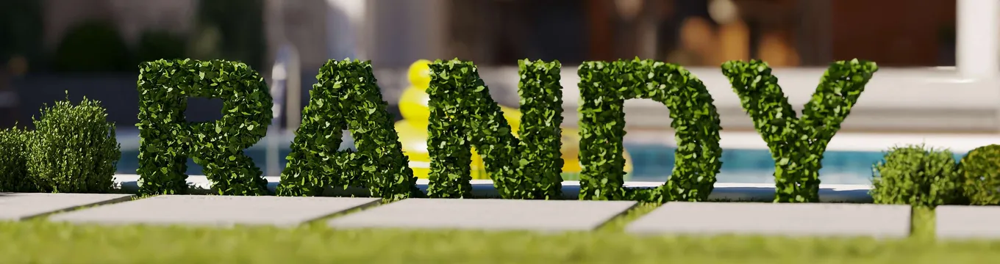
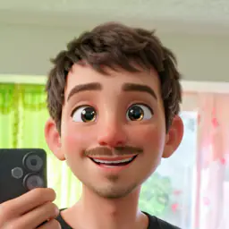
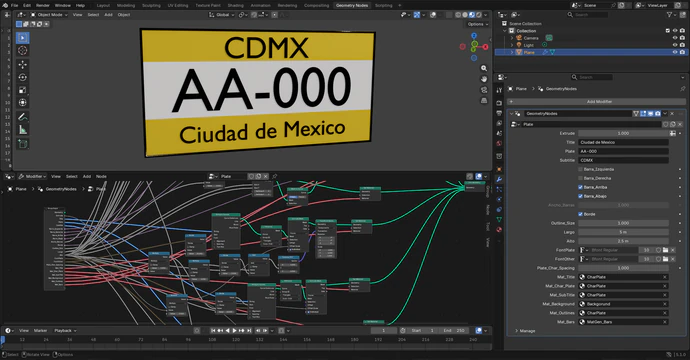
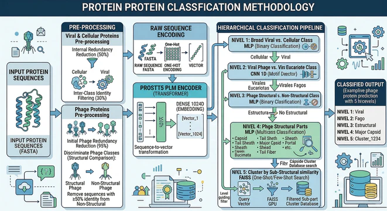
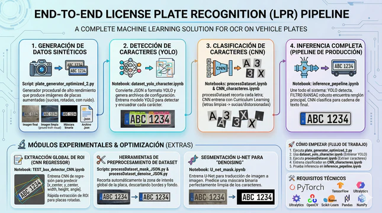
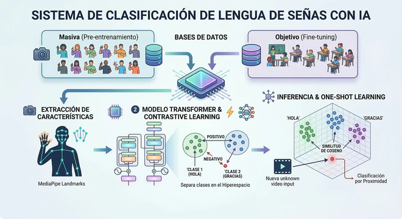
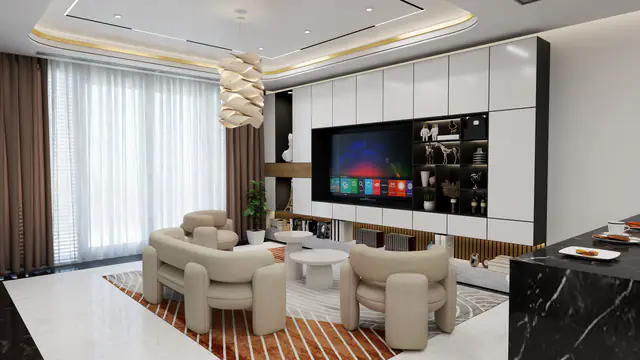
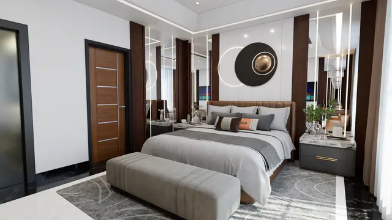
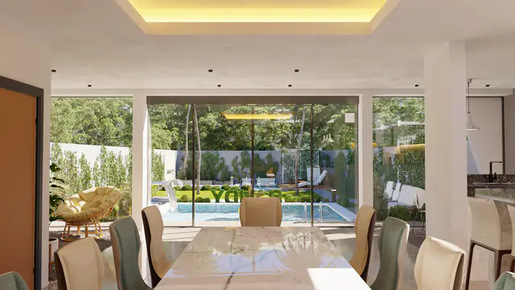
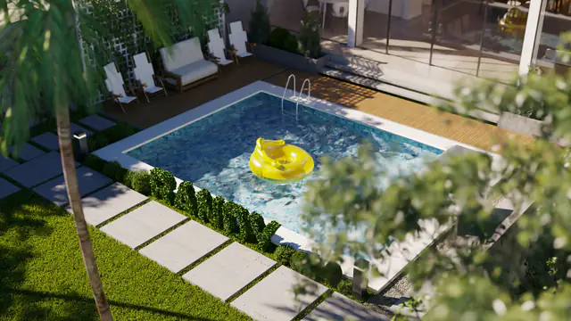

# Randy Santiago Riverol Arévalo
### Artificial Intelligence · 3D ArchViz · Game Design

  

  
  
  

---

## 🚀 Sobre mí

Perfil híbrido que combina la **Inteligencia Artificial** con el **diseño 3D**, **ArchViz** y el **desarrollo de videojuegos**. 

Como egresado de IA por la UAEM, me especializo en pipelines de Machine Learning y Deep Learning end-to-end. Además del arte 3D, exploro el mundo de la Inteligencia Artificial aplicada a la generación de imágenes, procesamiento de lenguaje natural y automatización. Aquí comparto mis experimentos y proyectos open-source.

---

## 🛠️ Habilidades Técnicas

### 🧠 AI & Machine Learning
- **Deep Learning:** CNNs (1D/2D), Transformers, VAEs, U-Net, MLPs, Few-Shot Learning, Contrastive Learning.
- **Computer Vision:** YOLO, TrOCR, VLMs, MediaPipe, RANSAC.
- **Bio Computacional:** CRISPR, MMSeq2, CD-HIT, ProstT5, FAISS.
- **Frameworks:** Python, PyTorch, TensorFlow, Keras, Jupyter.

### 🎨 3D, ArchViz & Game Design
- **Modelado 3D:** Blender, 3ds Max, Cinema 4D.
- **Visualización Arquitectónica:** ArchViz, Rendering fotorrealista, V-Ray, Tours Virtuales.
- **Game Dev:** Unity, Creación de Assets, Shaders PBR, Desarrollo Mobile.

---

## 🔬 Proyectos de IA Destacados

<table>
  <tr>
    <td width="50%">
      
       <b>Basic procedural plate generator in Blender</b> Generador de platos usando nodos y automatización.
    </td>
    <td width="50%">
      
       <b>Phage Protein Clasification MultiLevel</b> Clasificador multinivel de proteínas de fagos.
    </td>
  </tr>
  <tr>
    <td width="50%">
      
       <b>License Plate Recognition Pipeline</b> Detección, segmentación y OCR de matrículas de extremo a extremo.
    </td>
    <td width="50%">
      
       <b>Sign Language Recognition</b> Reconocimiento de señas mediante Embeddings Contrastivos.
    </td>
  </tr>
</table>

---

## 🏛️ Visualización 3D & Videojuegos
A lo largo de los años, he desarrollado proyectos de visualización arquitectónica y contenido 3D para empresas y clientes internacionales:

- **ArchViz:** Renders fotorrealistas de interiores y exteriores (V-Ray, Corona, Unreal Engine).
- **Videojuegos:** Desarrollo de entornos, personajes y assets optimizados para Unity. Proyectos destacados como *Taberna Palmares*, *CigarBar Comodoro* y *Dulcinea*.

<table>
  <tr>
    <td width="50%"></td>
    <td width="50%"></td>
  </tr>
  <tr>
    <td width="50%"></td>
    <td width="50%"></td>
  </tr>
</table>

---

## 📬 Conectemos
- 📧 [maxdesigna7x@gmail.com](mailto:maxdesigna7x@gmail.com)
- 💼 [Mi Portafolio Completo](https://maxdesigna7x.github.io/Portfolio_Randy/)
- 📍 Cuernavaca, Morelos, México

---

  <i>"Mezclando el arte con la ciencia de los datos."</i>

